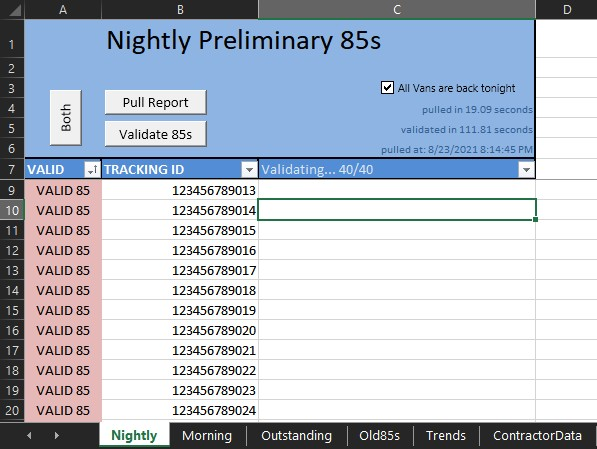
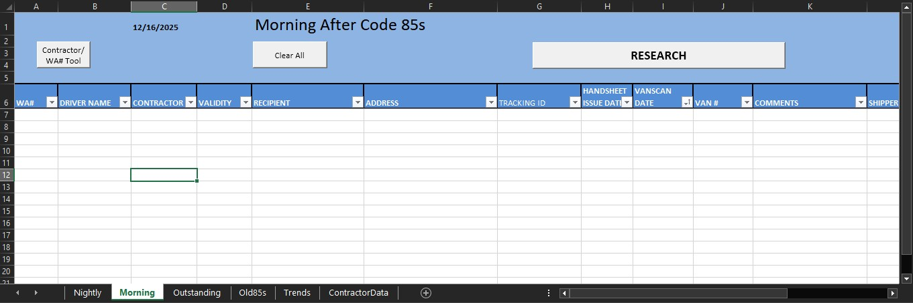
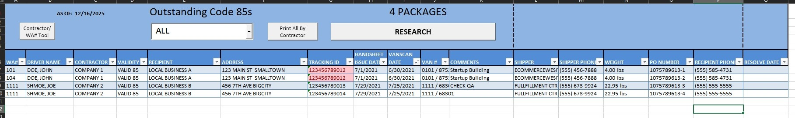
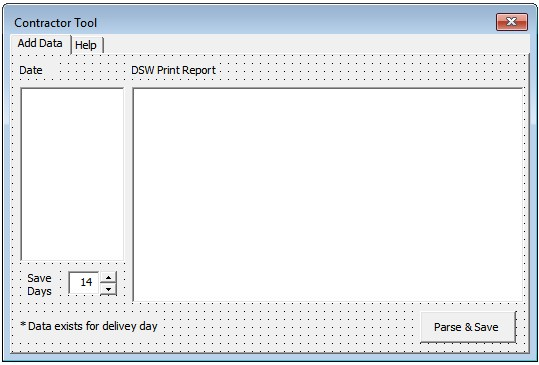
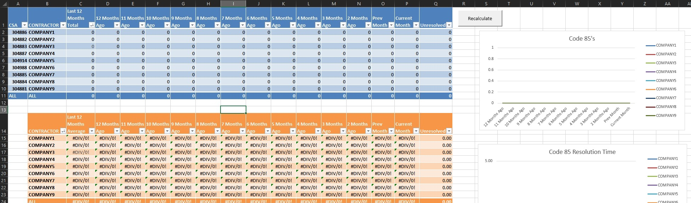

# Delivery Reconciliation Automation

This repository documents an internal automation system I built to streamline delivery exception reconciliation at a FedEx Ground station. The system replaced a manual, multi-hour administrative workflow with structured automation for tracking validation, follow-up, and reporting.

The project demonstrates **automation engineering**, **structured data extraction and transformation**, and **operational tooling design**, with an emphasis on reducing administrative overhead while fitting into existing workflows.

---

## Table of Contents
- [Problem](#problem)
- [What the System Does](#what-the-system-does)
- [Impact](#impact)
- [Screenshots](#screenshots)
- [Technical Stack](#technical-stack)
- [Case Study](#case-study)
- [Notes](#notes)

---

## Problem

Each night, dozens of packages were flagged as missing final delivery confirmation. Ops Admins were responsible for validating these exceptions, researching tracking histories across multiple internal tools, preparing follow-up delivery records, and tracking resolution over time. This process typically required **1–3 hours** of focused manual effort per night.

---

## What the System Does

- Automates retrieval and interpretation of tracking data from internal web-based tools
- Normalizes and enriches shipment, address, and driver information
- Generates and populates standardized delivery record templates (handsheets)
- Tracks unresolved exceptions across a rolling 30-day lifecycle
- Produces management-level summaries of reconciliation trends by contractor

---

## Impact

- Reduced nightly validation work for Ops Admins from **1–3 hours to under 10 minutes**
- Eliminated handwriting of **100+ delivery records per week**
- Simplified and centralized reconciliation workflows for Ops Admins
- Provided management with high-level visibility into reconciliation trends

---

## Screenshots

### Nightly Validation Workflow
Automated validation of delivery exceptions, replacing a manual multi-hour process.

### Morning Ops Workflow
Batch enrichment and research tools supporting follow-up and customer contact.

### Outstanding Exception Tracking
Centralized tracking of unresolved delivery exceptions across a rolling 30-day window.

### Contractor Data Input (Fallback Tool)
Backup form for importing and parsing driver data when automated imports were unavailable.

### Management Summary View
Aggregated trends and response-time summaries by contractor.

---

## Technical Stack

- Excel (.xlsm)
- VBA for workflow orchestration and automation
- Power Query (Get & Transform) for structured web data extraction
- Template-based worksheet duplication and automated formatting

---

## Case Study

A detailed breakdown of the workflow, automation design, and technical implementation is available here:

- **[Full Case Study](CASE_STUDY.md)**

---

## Notes

- Built for internal use; proprietary systems are not accessible outside the FedEx network
- Included workbook is cleaned and provided for structural reference only
- Screenshots are used to illustrate layout and workflow where live interaction is not possible
